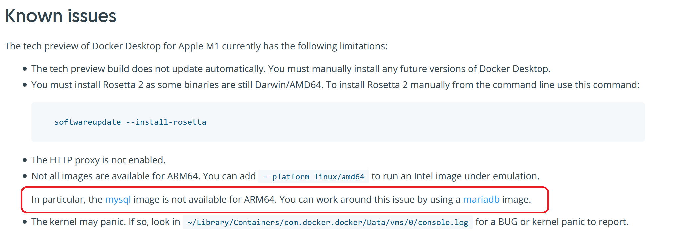

# Wall of shame
Inspired by the official Docker documentation, [which publicly shames mysql for not supporting ARM and recommends the usage of mariadb instead](https://docs.docker.com/docker-for-mac/apple-m1/#known-issues). This is as funny as it gets, when it comes to technical documentation for a containerization tool.

With the arrival of the new M1 Macs, and with every new Raspberrry pi release, more and more people realize how bad the software support for the ARM architecure actually is. 

Docker is not the only way, but a very convinient one to deploy software. The [official Dockerhub](https://hub.docker.com/search?q=&type=image) page can only filter/sort for a specific architecture, and not for the lack of support. Where is the list of the dockerhub projects which do not support ARM? That is what this website does. It takes a daily snapshot of the official data, and lists the projects which do _not_ support ARM. It's still not great, because of the partial support of some projects, but it's better then nothing.

On 14.02.2021 11:00 UTC, 81.08 % of the top 2500 projects did not support ARM.

Some useful links:
- [ARM on wikipedia](https://en.wikipedia.org/wiki/ARM_architecture)
- [ARM64](https://en.wikipedia.org/wiki/AArch64)